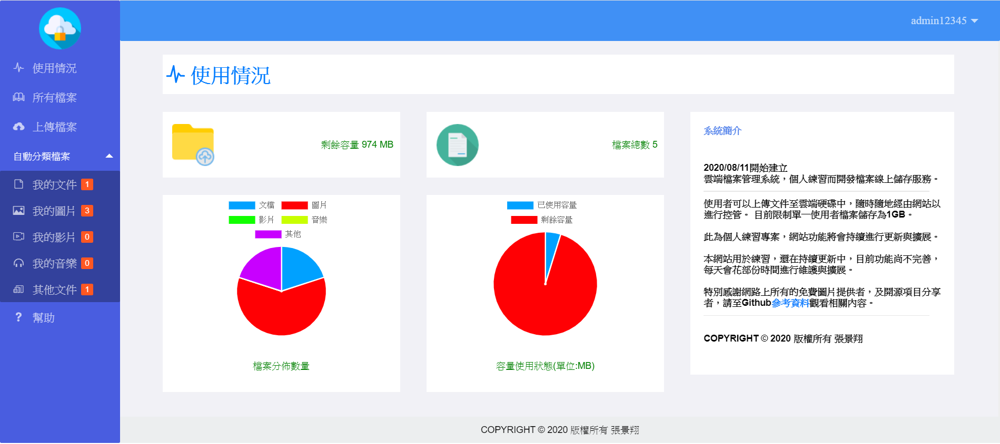

# 雲端檔案管理系統
此為個人練習的網站項目。

注意事項
---
    
    1.若要進行引用，請修改application.yml內的資料庫信息，以及檔案上傳路徑。
    2.若要使用圖片，請標記原圖片作者的連結。請看參考資料。
    
# 使用技術一覽

前端相關
---
* HTML
* CSS
* JavaScript
* Jquery+Ajax
* Layui

後端相關
---
* Springboot
* Mybatis + MybatisPlus
* Thymeleaf

資料庫
---
* MYSQL

資料庫建表
===

    CREATE DATABASE cloud_management;
    use cloud_management;

    DROP TABLE IF EXISTS `user`;

    #使用者資訊表
    CREATE TABLE user(

        `id` int(20) NOT NULL AUTO_INCREMENT COMMENT '使用者id',
        `username` varchar(30) DEFAULT NULL COMMENT '帳號',
        `password` varchar(30) DEFAULT NULL COMMENT '密碼',
        `name` varchar(30) DEFAULT NULL COMMENT '姓名',
         PRIMARY KEY(`id`)

    )ENGINE=InnoDB DEFAULT CHARSET=utf8;

    DROP TABLE IF EXISTS `user_files`;

    #使用者檔案資訊儲存表
    CREATE TABLE user_files(

      `id` int(11) NOT NULL COMMENT '檔案持有者id',
        `file_id` int(11) AUTO_INCREMENT COMMENT '檔案id',
        `file_name` varchar(255) DEFAULT NULL COMMENT '檔案名稱',
        `size` int(11) DEFAULT NULL COMMENT '檔案大小',
        `type` int(11) DEFAULT NULL COMMENT '檔案類型',
        `download_time` int(11) DEFAULT '0' COMMENT '下載次數',
        `postfix` varchar(255) DEFAULT NULL COMMENT '副檔名',

        PRIMARY KEY(`file_id`)

    )ENGINE=InnoDB DEFAULT CHARSET=utf8;

    DROP TABLE IF EXISTS `user_store`;

    #使用者硬碟使用狀態表
    CREATE TABLE user_store(

        `id` int(11) NOT NULL COMMENT '檔案持有者id',
        `store_id` int(11) AUTO_INCREMENT COMMENT '倉庫id',
        `current_size` int(11) DEFAULT NULL COMMENT '當前容量',
        `max_size` int(11) DEFAULT NULL COMMENT '總容量限制',
        PRIMARY KEY(`store_id`)

    )ENGINE=InnoDB DEFAULT CHARSET=utf8;
    
# 介面截圖
預計將進行介面美化。

登入與註冊介面
---

管理介面
---

# 參考資料

開源項目
---
* https://github.com/373675032/moti-cloud

圖片資源
---
* https://www.flaticon.com/free-icon/password_3194019?term=login&page=1&position=90
* https://www.flaticon.com/free-icon/cloud-computing_818971?term=cloud&page=2&position=11
* https://www.flaticon.com/free-icon/file_573263?term=Folder%20document&page=2&position=2
* https://www.flaticon.com/free-icon/picture_603496?term=image&page=1&position=37

